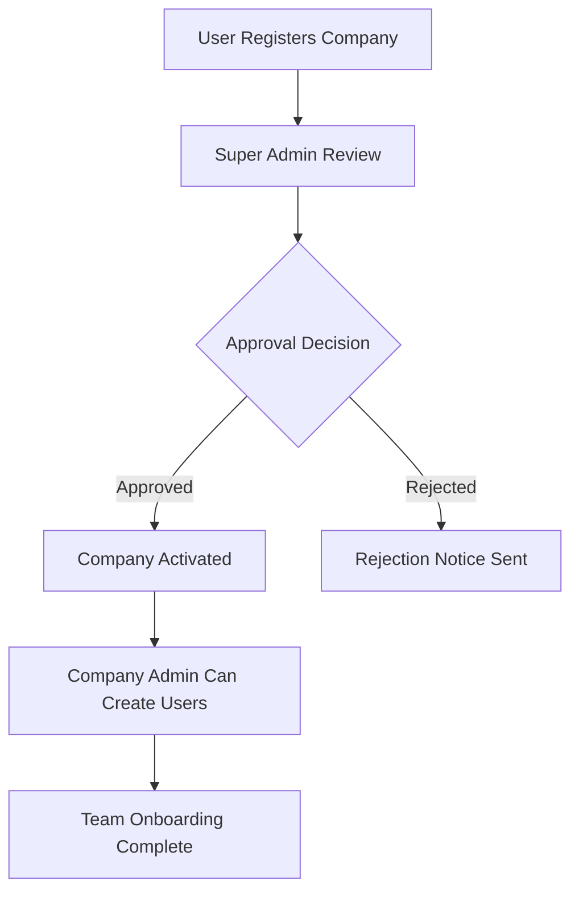
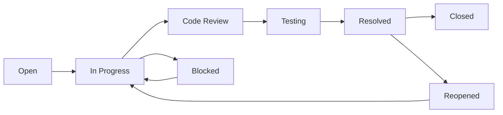
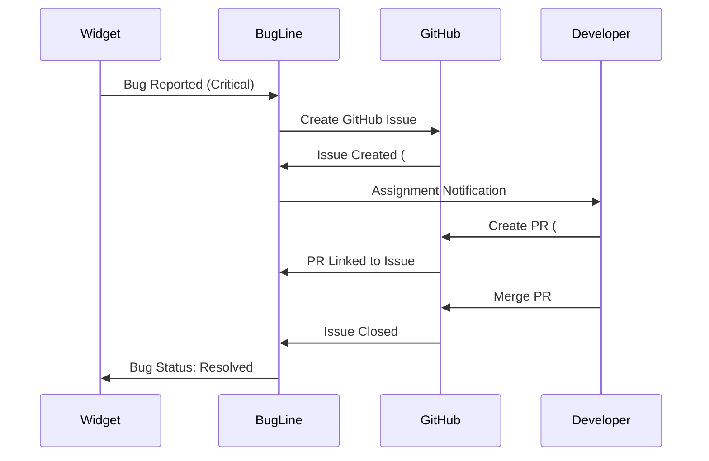
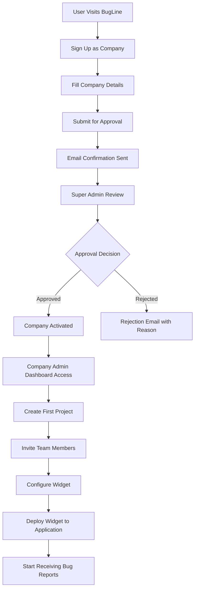
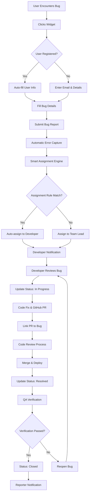
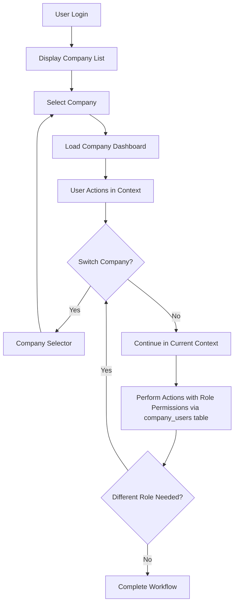

# BugLine - Enhanced Product Requirements Document (PRD) v2.2

## 📋 Executive Summary

**Product Name:** BugLine  
**Product Type:** B2B SaaS Bug Reporting & Management Platform  
**Version:** 2.2 (Post-MVP Enhanced)  
**Target Market:** Software Companies, Development Teams, and Individual Developers  
**Launch Timeline:** Q2 2025  

### Vision Statement
BugLine transforms bug reporting from a fragmented, manual process into a streamlined, intelligent ecosystem. Our embeddable widget enables seamless bug capture directly from web applications, while our comprehensive dashboard provides complete visibility and control over the entire bug resolution lifecycle with GitHub integration and automated workflows.

### Mission
To eliminate the friction between bug discovery and resolution, empowering development teams to build better software faster through intelligent automation and comprehensive tracking.

---

## 🎯 Strategic Goals & Success Metrics

### Primary Objectives

**🚀 Streamline Bug Discovery**
- One-click bug reporting with automatic error capture and environment detection
- Reduce bug reporting time from 5+ minutes to under 30 seconds

**🏢 Centralize Bug Management**
- Unified multi-tenant dashboard supporting unlimited companies and projects
- Complete audit trail and activity tracking for compliance and analytics

**🤖 Automate Intelligent Workflows**
- Smart bug assignment based on severity, category, and team expertise
- GitHub integration for seamless development workflow integration

**👥 Enable Collaborative Resolution**
- Role-based access control supporting both internal teams and external users
- Real-time notifications and status updates across the organization

**📊 Provide Actionable Insights**
- Comprehensive analytics on bug trends, team performance, and resolution times
- Custom reporting and data export capabilities

### Key Performance Indicators (KPIs)

| Metric | Target | Timeline |
|--------|--------|----------|
| **Adoption** | 500+ companies onboarded | 12 months |
| **Engagement** | 85% monthly active usage | Ongoing |
| **Efficiency** | 60% reduction in bug resolution time | 6 months |
| **Coverage** | Support for 10+ programming languages/frameworks | 9 months |
| **Retention** | 90% annual retention rate | 12 months |
| **Revenue** | $500K ARR | 18 months |

---

## 👥 Enhanced User Personas & Journeys

### 1. **Super Admin** (Platform Administrator)
**Profile:** Technical Operations Manager, Platform Owner  
**Goals:** Maintain platform integrity, ensure quality company onboarding  
**Pain Points:** Manual company verification, platform abuse prevention  
**Journey:**
- Monitor company registration requests
- Verify company legitimacy and approve/reject applications
- Oversee platform usage and handle escalations
- Manage system-wide settings and configurations

### 2. **Company Admin** (Engineering Manager/CTO)
**Profile:** Technical Leader responsible for team productivity  
**Goals:** Optimize team efficiency, maintain code quality, manage resources  
**Pain Points:** Scattered tools, unclear team workload, manual user management  
**Journey:**
- Register company and await approval
- Set up projects and configure widget settings
- Create team member accounts with appropriate roles
- Monitor team performance and bug resolution metrics
- Generate reports for stakeholders

### 3. **Developer** (Software Engineer)
**Profile:** Full-stack or specialized developer  
**Goals:** Clear bug descriptions, efficient resolution, minimal context switching  
**Pain Points:** Incomplete bug reports, missing technical context, manual status updates  
**Journey:**
- Receive bug assignments with complete technical context
- Update bug status as work progresses
- Collaborate with team through comments and GitHub integration
- Close bugs with resolution notes

### 4. **QA Engineer/Reporter** (Quality Assurance Professional)
**Profile:** Dedicated testing professional  
**Goals:** Systematic bug discovery, comprehensive reporting, regression tracking  
**Pain Points:** Complex reporting tools, poor bug tracking visibility  
**Journey:**
- Report bugs with detailed reproduction steps
- Track bug status and resolution progress
- Verify fixes and manage regression testing
- Generate testing reports and metrics

### 5. **End User** (Product Users/Customers)
**Profile:** Non-technical product users  
**Goals:** Simple bug reporting, feedback on fixes  
**Pain Points:** Complex reporting processes, no visibility into resolution  
**Journey:**
- Encounter bug and click embedded widget
- Submit bug report with minimal friction
- Receive acknowledgment and tracking information
- Optional: Get notified when bug is resolved

---

## 🚀 Comprehensive Feature Specifications

### **Core Platform Features (MVP - v2.0)**

#### **1. Advanced User Authentication & Company Management**

**Multi-Tenant User System:**
- Users can belong to multiple companies with different roles per company
- Secure JWT-based authentication with refresh tokens
- Email verification required for all account activations
- Company-specific role inheritance and permission management

**Company Registration Workflow:**


**Enhanced Role-Based Access Control:**

| **Role** | **Global Scope** | **Company Scope** | **Key Permissions** |
|----------|------------------|-------------------|-------------------|
| **Super Admin** | System-wide | All companies | Company approval, platform monitoring, system settings |
| **Company Admin** | None | Single company | User management, project creation, full bug oversight |
| **Developer** | None | Single company | Bug resolution, status updates, code integration |
| **QA/Reporter** | None | Single company | Comprehensive bug reporting, testing workflows |
| **User** | None | Single company | Basic bug reporting, own bug tracking |

*Role assignments managed through the `company_users` table*

#### **2. Intelligent Project & Widget Management**

**Project Configuration:**
- Unlimited projects per company (paid plans)
- Domain-restricted widget deployment with CSP compliance
- Customizable widget themes and branding
- A/B testing capabilities for widget variations

**Advanced Widget Features:**
```javascript
// Enhanced Widget Integration
BugLine.init({
  projectToken: 'uuid-based-project-token',
  
  // Security & Performance
  domainRestrictions: ['app.example.com', '*.example.com'],
  rateLimiting: { maxReports: 10, timeWindow: 300 }, // 10 reports per 5 min
  
  // Capture Configuration
  autoErrorCapture: true,
  consoleErrorCapture: true,
  networkErrorCapture: false, // Pro feature
  performanceMetrics: true,
  
  // UI Customization
  theme: 'auto', // light, dark, auto
  position: 'bottom-right',
  primaryColor: '#007bff',
  customCSS: '/path/to/custom.css',
  
  // Callback Handlers
  onLoad: () => console.log('Widget loaded'),
  onBugReported: (bug) => analytics.track('bug_reported', bug),
  onError: (error) => console.error('Widget error:', error)
});
```

#### **3. Comprehensive Bug Management Dashboard**

**Multi-Company Navigation:**
- Unified dashboard with company switcher
- Company-specific branding and themes
- Role-appropriate feature visibility
- Cross-company analytics for super admins

**Advanced Bug Lifecycle:**


**Enhanced Filtering & Search:**
- Full-text search across bug titles, descriptions, and comments
- Advanced filters: assignee, reporter, date range, GitHub status
- Saved filter presets for common workflows
- Bulk operations with conflict resolution

#### **4. GitHub Integration & Development Workflow**

**Bidirectional Synchronization:**
- Automatic GitHub issue creation for critical bugs
- Pull request linking and status synchronization
- Commit message parsing for automatic bug updates
- Branch and deployment tracking

**Integration Workflow:**


#### **5. Real-Time Collaboration & Notifications**

**WebSocket-Based Updates:**
- Live dashboard updates without page refresh
- Real-time comment and status change notifications
- Collaborative editing indicators
- Connection status and offline support

**Multi-Channel Notifications:**
- In-app notifications with action buttons
- Email digests and instant alerts
- Slack/Teams integration (Enterprise)
- Mobile push notifications (future)

---

### **Enhanced Database Architecture**

#### **Updated Table Structure (Based on README v2.2):**

```sql
-- Users Table (Simplified MVP Structure from README)
CREATE TABLE users (
    id UUID PRIMARY KEY DEFAULT gen_random_uuid(),
    email VARCHAR(255) UNIQUE NOT NULL,
    password_hash VARCHAR(255) NOT NULL,
    full_name VARCHAR(255) NOT NULL,
    global_role VARCHAR(20) DEFAULT 'USER', -- SUPER_ADMIN, USER
    created_at TIMESTAMP DEFAULT CURRENT_TIMESTAMP,
    updated_at TIMESTAMP DEFAULT CURRENT_TIMESTAMP
);

-- Companies Table (Simplified MVP Structure from README)
CREATE TABLE companies (
    id UUID PRIMARY KEY DEFAULT gen_random_uuid(),
    name VARCHAR(255) NOT NULL,
    slug VARCHAR(100) UNIQUE NOT NULL,
    created_at TIMESTAMP DEFAULT CURRENT_TIMESTAMP,
    updated_at TIMESTAMP DEFAULT CURRENT_TIMESTAMP
);

-- CompanyUser Table (Exact naming from README)
CREATE TABLE company_users (
    id UUID PRIMARY KEY DEFAULT gen_random_uuid(),
    user_id UUID REFERENCES users(id) ON DELETE CASCADE,
    company_id UUID REFERENCES companies(id) ON DELETE CASCADE,
    role VARCHAR(50) NOT NULL, -- ADMIN, DEVELOPER, QA, OTHERS
    created_at TIMESTAMP DEFAULT CURRENT_TIMESTAMP,
    updated_at TIMESTAMP DEFAULT CURRENT_TIMESTAMP,
    
    UNIQUE(user_id, company_id)
);

-- Projects Table (Simplified MVP Structure from README)
CREATE TABLE projects (
    id UUID PRIMARY KEY DEFAULT gen_random_uuid(),
    company_id UUID REFERENCES companies(id) ON DELETE CASCADE,
    name VARCHAR(255) NOT NULL,
    slug VARCHAR(100) NOT NULL,
    created_at TIMESTAMP DEFAULT CURRENT_TIMESTAMP,
    updated_at TIMESTAMP DEFAULT CURRENT_TIMESTAMP,
    
    UNIQUE(company_id, slug)
);

-- Bugs Table (Simplified MVP Structure from README)
CREATE TABLE bugs (
    id UUID PRIMARY KEY DEFAULT gen_random_uuid(),
    project_id UUID REFERENCES projects(id) ON DELETE CASCADE,
    title VARCHAR(500) NOT NULL,
    description TEXT NOT NULL,
    status VARCHAR(20) DEFAULT 'open', -- open, in_progress, resolved, closed
    priority VARCHAR(20) DEFAULT 'medium', -- low, medium, high, critical
    reporter_email VARCHAR(255),
    assigned_to UUID REFERENCES users(id),
    created_at TIMESTAMP DEFAULT CURRENT_TIMESTAMP,
    updated_at TIMESTAMP DEFAULT CURRENT_TIMESTAMP
);

-- Additional Tables from README (Simplified for MVP)
CREATE TABLE bug_comments (
    id UUID PRIMARY KEY DEFAULT gen_random_uuid(),
    bug_id UUID REFERENCES bugs(id) ON DELETE CASCADE,
    user_id UUID REFERENCES users(id) ON DELETE SET NULL,
    content TEXT NOT NULL,
    created_at TIMESTAMP DEFAULT CURRENT_TIMESTAMP
);

CREATE TABLE bug_activities (
    id UUID PRIMARY KEY DEFAULT gen_random_uuid(),
    bug_id UUID REFERENCES bugs(id) ON DELETE CASCADE,
    user_id UUID REFERENCES users(id) ON DELETE SET NULL,
    action VARCHAR(50) NOT NULL,
    old_value TEXT,
    new_value TEXT,
    created_at TIMESTAMP DEFAULT CURRENT_TIMESTAMP
);

CREATE TABLE invitations (
    id UUID PRIMARY KEY DEFAULT gen_random_uuid(),
    company_id UUID REFERENCES companies(id) ON DELETE CASCADE,
    email VARCHAR(255) NOT NULL,
    role VARCHAR(50) NOT NULL,
    status VARCHAR(20) DEFAULT 'pending', -- pending, accepted, expired, cancelled
    token VARCHAR(255) UNIQUE NOT NULL,
    expires_at TIMESTAMP NOT NULL,
    created_at TIMESTAMP DEFAULT CURRENT_TIMESTAMP
);
```

---

## 🔄 Enhanced User Flows

### **1. Company Onboarding Flow**


### **2. Bug Reporting & Resolution Flow**


### **3. Multi-Company User Flow**


---

## 🚗 Roadmap & Future Enhancements

### **Phase 1: Core Platform (Q2 2025) ✅**
- ✅ Multi-tenant user management
- ✅ Company approval workflow
- ✅ Basic bug reporting and dashboard
- ✅ Role-based access control
- ✅ Embeddable widget (basic)

### **Phase 2: Enhanced Integration (Q3 2025)**
- 🔄 GitHub bidirectional sync
- 🔄 Real-time WebSocket updates
- 🔄 Advanced widget customization
- 🔄 Email notification system
- 📋 File upload support (screenshots, videos)

### **Phase 3: Analytics & Intelligence (Q4 2025)**
- 📋 Comprehensive analytics dashboard
- 📋 AI-powered bug categorization
- 📋 Predictive assignment algorithms
- 📋 Performance metrics and SLA tracking
- 📋 Custom reporting engine

### **Phase 4: Enterprise Features (Q1 2026)**
- 📋 SSO integration (SAML, OAuth)
- 📋 White-label solutions
- 📋 Advanced security features
- 📋 Multi-region deployment
- 📋 Enterprise API with webhooks

### **Phase 5: Advanced Collaboration (Q2 2026)**
- 📋 Slack/Teams deep integration
- 📋 Mobile applications (iOS/Android)
- 📋 Video call integration for bug discussions
- 📋 Advanced workflow automation
- 📋 Integration marketplace

---

## 📊 Success Metrics & KPIs

### **Technical Performance**
- **Widget Load Time:** < 1.5 seconds (95th percentile)
- **Dashboard Response Time:** < 500ms (average)
- **System Uptime:** 99.9% SLA
- **Data Security:** SOC 2 Type II compliance

### **Business Metrics**
- **Monthly Recurring Revenue (MRR):** $50K by month 12
- **Customer Acquisition Cost (CAC):** < $200
- **Customer Lifetime Value (CLV):** > $2,000
- **Net Promoter Score (NPS):** > 50

### **User Engagement**
- **Monthly Active Users:** 85%+ of registered users
- **Bug Resolution Time:** 50% improvement over traditional tools
- **User Satisfaction:** 4.5+ stars on review platforms
- **Feature Adoption:** 70%+ of users using advanced features

---

## 🎉 Launch Criteria & Success Definition

### **MVP Exit Criteria**
- [ ] 100+ companies successfully onboarded
- [ ] Widget deployed on 500+ domains
- [ ] 10,000+ bug reports processed
- [ ] GitHub integration tested with 50+ repositories
- [ ] 99.5% uptime maintained for 30 consecutive days
- [ ] All security audits passed
- [ ] Customer support response time < 4 hours

### **Post-Launch Success Metrics (6 months)**
- [ ] 500+ active companies
- [ ] $25K MRR achieved
- [ ] 80% user retention rate
- [ ] 15+ integration partnerships
- [ ] Expansion into 3+ new markets
- [ ] Series A funding secured

---

**Document Version:** 2.2  
**Status:** Ready for Development & QA Implementation